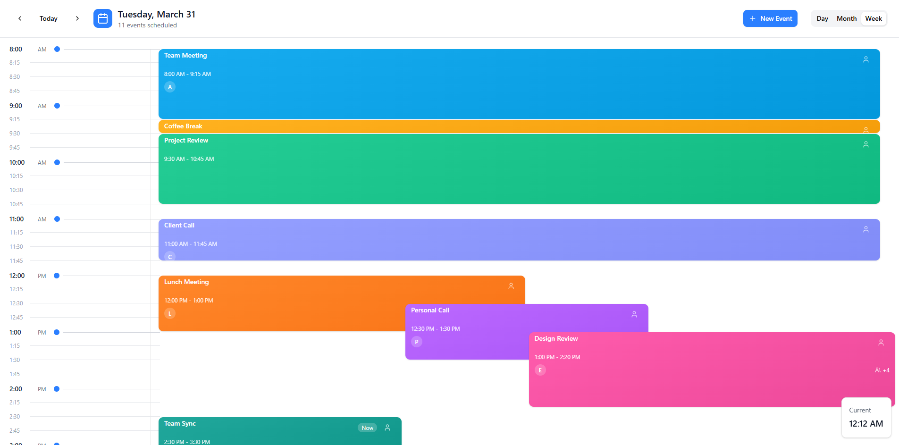

# Modern Calendar

A modern, responsive, and accessible calendar component for Svelte applications. Inspired by [React Big Calendar](https://www.npmjs.com/package/react-big-calendar).

> [!WARNING]
> This project is in its early alpha stage. The API is subject to change.



## Features

- ✅ Built with Svelte 5
- ✅ Fully typed with TypeScript
- ✅ Styled with Tailwind CSS
- ✅ Draggable and resizable events planned
- ✅ Shadcn UI components

## Installation

```bash
npm install svelte-modern-calendar
# or
yarn add svelte-modern-calendar
# or
pnpm add svelte-modern-calendar
```

## Basic Usage

```svelte
<!-- src/routes/+page.svelte -->
<script lang="ts">
	import { Calendar } from 'svelte-modern-calendar';
	import 'svelte-modern-calendar/dist/style.css'; // This path will be available after packaging

	const events = [
		{
			title: 'Meeting with team',
			start: new Date('2025-06-13T10:00:00'),
			end: new Date('2025-06-13T11:00:00')
		},
		{
			title: 'Lunch break',
			start: new Date('2025-06-13T13:00:00'),
			end: new Date('2025-06-13T14:00:00')
		}
	];
</script>

<div class="h-screen">
	<Calendar {events} />
</div>
```

## Contributing

Contributions are welcome! Please open an issue or submit a pull request.

## License

[MIT](LICENSE)
